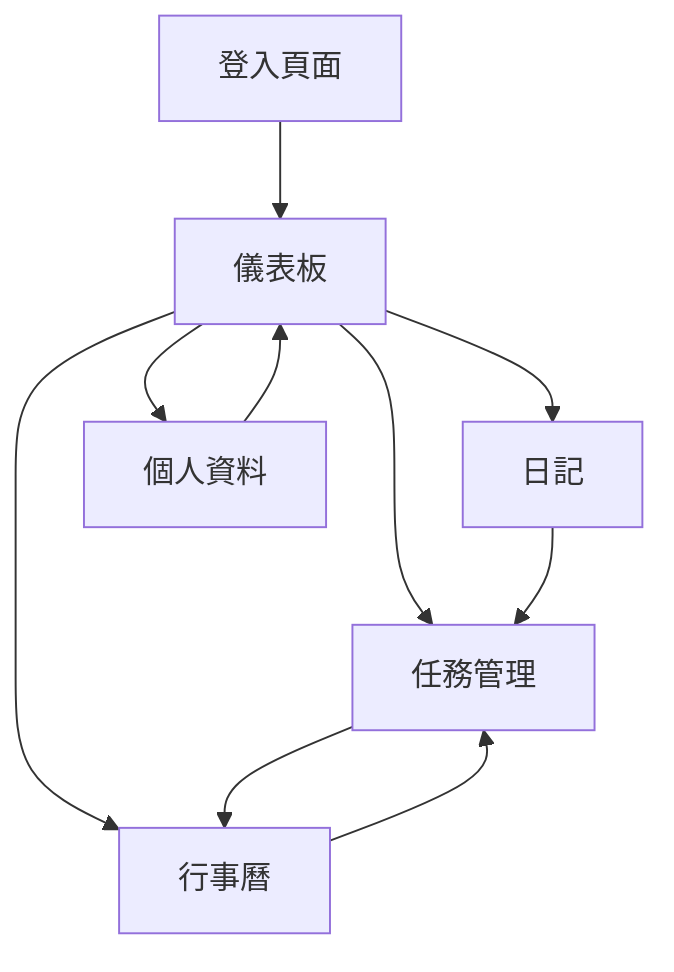

# 任務管理系統開發計畫

## 1. 產品概述

這是一個功能完整的任務管理軟體系統，採用極簡美學設計，支援多層級任務結構、行事曆整合、日記功能和即時同步。系統旨在幫助個人和團隊高效管理任務、時間和記錄，提供流暢的使用者體驗和可靠的數據同步。

目標用戶包括需要高效任務管理的個人用戶、自由工作者、小型團隊，以及注重設計美學和數據同步的專業人士。

## 2. 核心功能

### 2.1 使用者角色

| 角色    | 註冊方式                              | 核心權限                     |
| ----- | --------------------------------- | ------------------------ |
| 一般使用者 | 電子郵件/密碼、Google OAuth、WeChat OAuth | 個人任務管理、行事曆檢視、日記記錄、個人資料設定 |
| 進階使用者 | 訂閱升級                              | 團隊協作、進階報表、客製化主題、API存取    |

### 2.2 功能模組

本系統包含以下主要頁面：

1. **登入/註冊頁面**：電子郵件密碼登入、Google OAuth、WeChat OAuth、忘記密碼
2. **任務管理頁面**：無限層級任務結構、任務創建編輯、多階層「標籤」設定、設定時間、耗時、母任務、狀態追蹤、進度（
3. **行事曆頁面**：日/週/月視圖、拖放排程、調整時間區間、任務與行事曆整合連動
4. **日記頁面**：Markdown編輯器、日記列表、搜尋功能、標籤管理
5. **個人資料頁面**：基本資訊、偏好設定、通知設定、帳戶安全
6. **儀表板頁面**：今日任務、進度概覽、統計圖表、快速操作3-

### 2.3 頁面詳情

| 頁面名稱    | 模組名稱        | 功能描述                                                    |
| ------- | ----------- | ------------------------------------------------------- |
| 登入/註冊頁面 | 認證系統        | 支援電子郵件/密碼登入、Google OAuth認證、WeChat OAuth認證、密碼重設功能、記住登入狀態 |
| 任務管理頁面  | 任務列表        | 顯示所有任務、支援多層級結構（任務→專案→大項目）、任務搜尋與篩選、批量操作功能                |
| 任務管理頁面  | 任務編輯        | 創建新任務、編輯任務詳情、設定優先級和截止日期、添加子任務和標籤、任務狀態管理                 |
| 行事曆頁面   | 日曆視圖        | 提供日視圖、週視圖、月視圖、顯示任務和事件、支援顏色編碼分類                          |
| 行事曆頁面   | 拖放排程        | 拖拽任務到不同日期、調整任務時間、自動更新任務截止日期、衝突提醒                        |
| 日記頁面    | Markdown編輯器 | 支援Markdown語法、即時預覽、圖片上傳、代辦事項清單、程式碼高亮                     |
| 日記頁面    | 日記管理        | 創建編輯刪除日記、按日期瀏覽、全文搜尋、標籤分類、匯出功能                           |
| 個人資料頁面  | 基本設定        | 編輯個人資訊、上傳頭像、變更密碼、設定語言和時區                                |
| 個人資料頁面  | 偏好設定        | 主題選擇、通知偏好、數據同步設定、隱私設定                                   |
| 儀表板頁面   | 今日概覽        | 顯示今日任務、即將到期任務、今日日記摘要、快速添加任務                             |
| 儀表板頁面   | 統計分析        | 任務完成率、時間分配圖表、生產力趨勢、成就徽章                                 |

## 3. 核心流程

### 使用者操作流程

1. **新用戶註冊流程**：

   * 選擇註冊方式（郵件/Google/WeChat）

   * 填寫基本資訊

   * 設定個人偏好

   * 進入儀表板開始使用

2. **任務管理流程**：

   * 創建任務並設定詳情

   * 組織任務層級結構

   * 在行事曆中安排時間

   * 追蹤任務進度

   * 完成任務並記錄

3. **日記記錄流程**：

   * 選擇日期

   * 使用Markdown編寫內容

   * 添加標籤和圖片

   * 儲存並同步

### 頁面導航流程

## 4. 使用者介面設計

### 4.1 設計風格

* **主色調**：極簡白 (#FFFFFF)、深空灰 (#2C3E50)、薄荷綠 (#48C9B0)、暖橙色 (#F39C12)

* **按鈕樣式**：圓角矩形設計，懸浮時有微陰影效果

* **字體**：系統預設字體，標題16-20px，正文14px，輔助文字12px

* **佈局風格**：卡片式設計，大量留白，極簡主義風格

* **圖標風格**：線性圖標，簡潔明了，符合WCAG 2.1無障礙標準

### 4.2 頁面設計概述

| 頁面名稱 | 模組名稱 | UI元素                              |
| ---- | ---- | --------------------------------- |
| 登入頁面 | 認證表單 | 置中卡片設計，簡潔的輸入框，明確的按鈕區分，支援OAuth快速登入 |
| 儀表板  | 今日任務 | 卡片式任務列表，優先級顏色標記，進度條顯示，快速操作按鈕      |
| 任務管理 | 任務列表 | 層級縮排顯示，摺疊展開功能，拖拽排序，批量選擇框          |
| 行事曆  | 月視圖  | 網格佈局，任務數量氣泡，今日高亮，週末區分顯示           |
| 日記   | 編輯器  | 分欄設計（編輯/預覽），工具列置頂，字數統計，自動儲存提示     |

### 4.3 響應式設計

* **桌面優先**：主要針對桌面端優化設計

* **平板適配**：768px以上保持完整功能，側邊欄可收合

* **手機適配**：375px以上提供核心功能，底部導航，簡化操作

* **觸控優化**：按鈕最小44px，支援手勢操作，觸控回饋

### 4.4 動畫與過渡效果

* **頁面切換**：淡入淡出效果，持續時間200-300ms

* **任務操作**：完成任務時的打勾動畫，刪除時的滑出效果

* **載入狀態**：骨架屏設計，微動畫載入指示器

* **拖拽反饋**：半透明拖拽狀態，目標區域高亮提示

## 5. 技術實現要求

### 5.1 前端技術

* **框架**：React 18+ with TypeScript

* **狀態管理**：Redux Toolkit + RTK Query

* **路由**：React Router v6

* **UI庫**：Tailwind CSS + Headless UI

* **Markdown編輯器**：React Markdown + Remark

* **行事曆**：React Big Calendar（客製化樣式）

### 5.2 後端技術

* **框架**：Node.js + Express.js + TypeScript

* **認證**：JWT + Passport.js（OAuth整合）

* **即時通訊**：Socket.io（WebSocket實現）

* **API設計**：RESTful + GraphQL（部分查詢優化）

* **檔案上傳**：Multer + AWS S3（或本地儲存）

### 5.3 數據庫設計

* **主數據庫**：PostgreSQL 14+

* **快取**：Redis（會話和即時數據）

* **搜尋**：PostgreSQL全文搜尋 + Elasticsearch（可選）

* **連接池**：PgBouncer（連接優化）

### 5.4 即時同步實現

* **WebSocket架構**：Socket.io房間機制（用戶隔離）

* **衝突解決**：樂觀鎖 + 版本號機制

* **離線支援**：IndexedDB + Service Worker

* **同步策略**：增量同步 + 壓縮傳輸

## 6. 品質保證要求

### 6.1 測試覆蓋

* **單元測試**：Jest + React Testing Library（覆蓋率≥80%）

* **整合測試**：Cypress（端到端測試）

* **API測試**：Supertest + Jest

* **性能測試**：K6（負載測試≥10,000並發用戶）

### 6.2 性能指標

* **Lighthouse評分**：Performance ≥90，Accessibility ≥95

* **載入時間**：首次載入≤3秒，後續載入≤1秒

* **同步延遲**：數據變更≤300ms跨設備同步

* **記憶體使用**：單頁應用≤100MB，無記憶體洩漏

### 6.3 無障礙設計

* **WCAG 2.1標準**：AA級別合規

* **鍵盤導航**：完整鍵盤操作支援

* **螢幕閱讀器**：ARIA標籤和語義化HTML

* **色彩對比**：最低4.5:1對比度比率

## 7. 部署要求

### 7.1 容器化部署

* **Docker化**：多階段構建，優化鏡像大小

* **編排**：Docker Compose（開發）/ Kubernetes（生產）

* **環境隔離**：開發、測試、生產環境分離

* **配置管理**：環境變數 + 配置中心

### 7.2 CI/CD流程

* **版本控制**：Git + Git Flow工作流

* **自動構建**：GitHub Actions / GitLab CI

* **自動測試**：代碼提交觸發完整測試套件

* **自動部署**：通過測試後自動部署到預發環境

### 7.3 監控與日誌

* **應用監控**：Prometheus + Grafana（性能指標）

* **錯誤追蹤**：Sentry（即時錯誤報告）

* **日誌管理**：ELK Stack（Elasticsearch + Logstash + Kibana）

* **健康檢查**：定期健康檢查和自動恢復

### 7.4 安全要求

* **數據加密**：TLS 1.3傳輸加密，AES-256靜態加密

* **認證安全**：多因素認證選項，定期安全審計

* **數據隱私**：GDPR合規，數據可攜性和刪除權

* **備份策略**：每日自動備份，異地儲存，定期恢復測試

